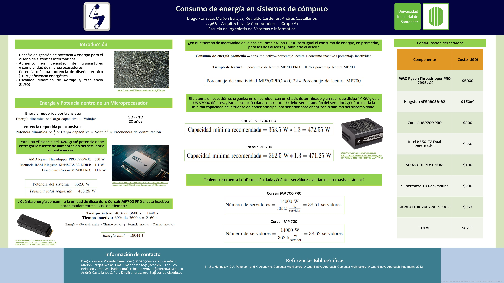

# Consumo de energía en sistemas de cómputo

## Equipo

- [@creepstyC](https://github.com/creepstyC)
- [@DieDev9](https://github.com/DieDev9)
- [@andr3sit011](https://github.com/%20andr3sit011e)
- [@reinaldocardenas23](https://github.com/reinaldocardenas23)

## Bibliografía
[[1] J.L. Hennessy, D.A. Patterson, and K. Asanovi ́c. Computer Architecture: A Quantitative Approach. Computer Architecture: A Quantitative Approach. Kaufmann, 2012.​](https://books.google.com.co/books/about/Computer_Architecture.html?id=v3-1hVwHnHwC&redir_esc=y)
