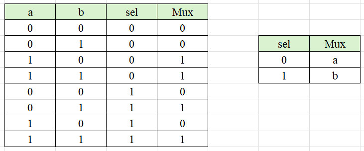

# Desarrollo

En este proyecto se realiza la construcción de un conjunto de compuertas lógicas que nos ayudarán mas adelante en la construcción de otros componentes importantes que conforman la estructura de un computador.


## Nand
La compuerta Nand está creada de manera nativa en las herramientas de nand2tetris, por lo cuál se usar para crear las siguientes compuertas progresivamente.

<p align="center">

</p>

## Not
Tomando la compuerta Nand como base, se observa que al tener el mismo valor en las entradas, la salida es el opuesto de este, p.ej, cuando a y b son 0, la salida de la Nand es 1 y viceversa. De esta forma y reduciendo la tabla de verdad se obtiene una equivalente a la compueta Not.

```verilog
CHIP Not {
    IN in;
    OUT out;

    PARTS:
    Nand(a=in, b=in, out=out);
}
```

<p align="center">

</p>

## And
Con la compuerta Nand nativa y la Not creada anteriormente se consigue llegar fácilmente a la compuerta And.

```verilog
CHIP And {
    IN a, b;
    OUT out;
    
    PARTS:
    Nand(a=a, b=b, out=nOut);
    Not(in=nOut, out=out);
}
```

<p align="center">

</p>

## Or
Para llegar a la compuerta Or se puede implementar la ley de DeMorgan en la compuerta Nand, negando al mismo tiempo sus entradas.

```verilog
CHIP Or {
    IN a, b;
    OUT out;

    PARTS:
    Not(in=a, out=na);
    Not(in=b, out=nb);
    Nand(a=na, b=nb, out=out);
}
```
<p align="center">

</p>

## Xor
Tomando como partida la tabla de verdad de la compuerta or exclusiva, se puede obtener su expresión booleana en términos de And, Or y Not.

Xor = A(¬B) + (¬A)B

<p align="center" text="center">

</p>

```
CHIP Xor {
    IN a, b;
    OUT out;

    PARTS:
    Not(in=a, out=na);
    Not(in=b, out=nb);
    And(a=na, b=b, out=and1);
    And(a=a, b=nb, out=and2);
    Or(a=and1, b=and2, out=out);
}
```

## Mux
La tabla de verdad de la compuerta Mux se puede reducir (en términos de And, Or y Not) de forma que esta sólo depende de la entrada sel. Cuándo 

Mux = (¬sel) a + sel b

<p align="center">

</p>

```
CHIP Mux {
    IN a, b, sel;
    OUT out;

    PARTS:
    Not(in=sel, out=nsel);
    And(a=a, b=nsel, out=and1);
    And(a=b, b=sel, out=and2);
    Or(a=and1, b=and2, out=out);
}
```
## And16
Un chip And de 16 bits aplica la operación booleana And a cada uno de los bits de su bus de entrada de 16 bits, se toma como base la compuerta And creada anteriormente.

```
CHIP And16
{
    IN a[16], b[16];
    OUT out[16];

    PARTS:
    And(a=a[0], b=b[0], out=out[0]);
    And(a=a[1], b=b[1], out=out[1]);
    And(a=a[2], b=b[2], out=out[2]);
    And(a=a[3], b=b[3], out=out[3]);
    And(a=a[4], b=b[4], out=out[4]);
    And(a=a[5], b=b[5], out=out[5]);
    And(a=a[6], b=b[6], out=out[6]);
    And(a=a[7], b=b[7], out=out[7]);
    And(a=a[8], b=b[8], out=out[8]);
    And(a=a[9], b=b[9], out=out[9]);
    And(a=a[10], b=b[10], out=out[10]);
    And(a=a[11], b=b[11], out=out[11]);
    And(a=a[12], b=b[12], out=out[12]);
    And(a=a[13], b=b[13], out=out[13]);
    And(a=a[14], b=b[14], out=out[14]);
    And(a=a[15], b=b[15], out=out[15]);
}
```

## OR16:
Un Chip Or de 16 bits aplica la operación booleana Or a cada uno de los bits de su bus de entrada de 16 bits.

```
{
    IN a[16], b[16];
    OUT out[16];

    PARTS:
    Or(a=a[0], b=b[0], out=out[0]);
    Or(a=a[1], b=b[1], out=out[1]);
    Or(a=a[2], b=b[2], out=out[2]);
    Or(a=a[3], b=b[3], out=out[3]);
    Or(a=a[4], b=b[4], out=out[4]);
    Or(a=a[5], b=b[5], out=out[5]);
    Or(a=a[6], b=b[6], out=out[6]);
    Or(a=a[7], b=b[7], out=out[7]);
    Or(a=a[8], b=b[8], out=out[8]);
    Or(a=a[9], b=b[9], out=out[9]);
    Or(a=a[10], b=b[10], out=out[10]);
    Or(a=a[11], b=b[11], out=out[11]);
    Or(a=a[12], b=b[12], out=out[12]);
    Or(a=a[13], b=b[13], out=out[13]);
    Or(a=a[14], b=b[14], out=out[14]);
    Or(a=a[15], b=b[15], out=out[15]);
}
```

## Mux16:
Un multiplexor de 16 bits es casi similar al Chip Multiplexor descrito anteriormente, excepto que ambas entradas son cada una de 16 bits de ancho, mientras que el selector es de un solo bit.

```
CHIP Mux16 {
    IN a[16], b[16], sel;
    OUT out[16];

    PARTS:
    Mux(a=a[0], b=b[0], sel=sel, out=out[0]);
    Mux(a=a[1], b=b[1], sel=sel, out=out[1]);
    Mux(a=a[2], b=b[2], sel=sel, out=out[2]);
    Mux(a=a[3], b=b[3], sel=sel, out=out[3]);
    Mux(a=a[4], b=b[4], sel=sel, out=out[4]);
    Mux(a=a[5], b=b[5], sel=sel, out=out[5]);
    Mux(a=a[6], b=b[6], sel=sel, out=out[6]);
    Mux(a=a[7], b=b[7], sel=sel, out=out[7]);
    Mux(a=a[8], b=b[8], sel=sel, out=out[8]);
    Mux(a=a[9], b=b[9], sel=sel, out=out[9]);
    Mux(a=a[10], b=b[10], sel=sel, out=out[10]);
    Mux(a=a[11], b=b[11], sel=sel, out=out[11]);
    Mux(a=a[12], b=b[12], sel=sel, out=out[12]);
    Mux(a=a[13], b=b[13], sel=sel, out=out[13]);
    Mux(a=a[14], b=b[14], sel=sel, out=out[14]);
    Mux(a=a[15], b=b[15], sel=sel, out=out[15]);
}
```

## Or8Way:
Una puerta Or de 8 vías da como resultado 1 cuando al menos un bit de su entrada de 16 bits es 1. A diferencia de las puertas lógicas de entrada de n bits, las puertas lógicas de n vías utilizan la misma salida de forma iterativa a lo largo de la operación booleana, lo que significa que utiliza la salida anterior como entrada para la siguiente operación booleana similar.
```
CHIP Or8Way {
    IN in[8];
    OUT out;

    PARTS:
    Or(a=in[0], b=in[1], out=o1);
    Or(a=o1, b=in[2], out=o2);
    Or(a=o2, b=in[3], out=o3);
    Or(a=o3, b=in[4], out=o4);
    Or(a=o4, b=in[5], out=o5);
    Or(a=o5, b=in[6], out=o6);
    Or(a=o6, b=in[7], out=out);
}
```

<p align="center" style="background-color: white;">
  
</p>

## Mux4Way16:
Un multiplexor con m vías y n bits permite seleccionar una de varias entradas de datos y dirigirla a una salida en función del selector. En este caso el multiplexor cuenta con 4 entradas, cada una de ellas con 16 bits.
```
CHIP Mux4Way16 {
    IN a[16], b[16], c[16], d[16], sel[2];
    OUT out[16];
    
    PARTS:
    	Mux16(a=a, b=b, sel=sel[0], out= ab);
	Mux16(a=c, b=d, sel=[0], out=cd);
	Mux16(a=ab, b=cd, sel=sel[1], out=out);
}
```
## Mux8Way16:
Un chip Mux8Way16 tiene un funcionamiento similar al Mux4Way16, solo que este cuenta con el doble de entradas con la misma cantidad de bits para cada una.
```
CHIP Mux8Way16 {
    IN a[16], b[16], c[16], d[16],
       e[16], f[16], g[16], h[16],
       sel[3];
    OUT out[16];

    PARTS:
    Mux16(a=a, b=b, c=c, d=d, sel=sel[0..1], out=abcd);
    Mux16(a=e, b=f, c=g, d=h, sel=sel[0..1], out=efgh);
    Mux16(a=abcd, b=efgh, sel=sel[2], out=out);
}
```
## DMux4Way:
Un demultiplexor de m vías funciona de manera contraria a como lo hace un multiplexor de m vías, ya que el demultiplexor se encarga de tomar una entrada y distribuirla en una de las m salidas posibles.
```
CHIP DMux4Way {
    IN in, sel[2];
    OUT a, b, c, d;

    PARTS:
	DMux(in=in,sel=sel[1],a=ab,b=cd);
	DMux(in=ao,sel=sel[0],a=a,b=b);
	DMux(in=bo,sel=sel[0],a=c,b=d);
}
```
## DMux8Way:
Funciona de la misma forma que un DMux4Way, solo que este distribuye una entrada en 8 posibles salidas en lugar de 4.
```
CHIP DMux8Way {
    IN in, sel[3];
    OUT a, b, c, d, e, f, g, h;

    PARTS:
    DMux(in=in, sel=sel[2], a=abcd, b=efgh);
    DMux4Way(in=abcd, sel=sel[0..1], a=a, b=b, c=c, d=d);
    DMux4Way(in=efgh, sel=sel[0..1], a=e, b=f, c=g, d=h);
}
```

## Preguntas adicioinales

### 1. ¿Qué consideraciones importantes debe tener en cuenta para trabajar con nand2tetris?

- Entender los fundamentos: Nand2Tetris es un curso que te lleva a través de la creación de una computadora desde cero. Por lo tanto, es crucial tener una comprensión sólida de los fundamentos de la ingeniería informática, lógica booleana y el funcionamiento de diferentes compuertas lógicas, primordialmente And, Or y Not.

- Habilidades de resolución de problemas: A lo largo del curso, te encontrarás con varios desafíos y problemas que requerirán habilidades de resolución de problemas y pensamiento crítico.

- Aprendizaje autodirigido: Nand2Tetris es en gran medida un curso de aprendizaje autodirigido. Necesitarás la capacidad de aprender de manera independiente y buscar recursos adicionales cuando sea necesario.

### 2. ¿Qué otras herramientas similares a Nand2Tetris existen? (De mínimo dos ejemplos)

- **[NandGame](https://nandgame.com/):** es una herramienta gráfica presentada como un juego interactivo, que cubre una pequeña parte del material presente en nand2tetris (sobre el cual está basado) y cuya intención es dar una introducción a la temática y el funcionamiento del mismo.

- **[Logic Gate Simulator](https://www.kolls.net/gatesim/):** es una herramienta de código abierto que permite experimentar con compuertas lógicas de manera introductoria y visual.

- **Circuitos integrados:** de manera práctica, se puede aprender sobre el funcionamiento de las compuertas lógicas y su implementación utilizando circuitos integrados que las contienen para construir otras más complejas o incluso con el uso de transistores.

- in-addr

- hackaday

## Bibliografía
[The elements of computing systems](https://www.nand2tetris.org/book)

[Apéndice 2: Guía HDL](https://drive.google.com/file/d/1dPj4XNby9iuAs-47U9k3xtYy9hJ-ET0T/view?usp=sharing)
