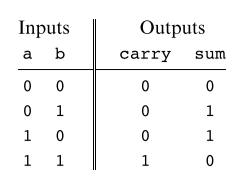
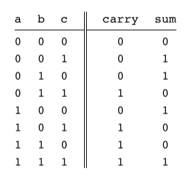
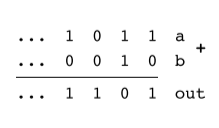
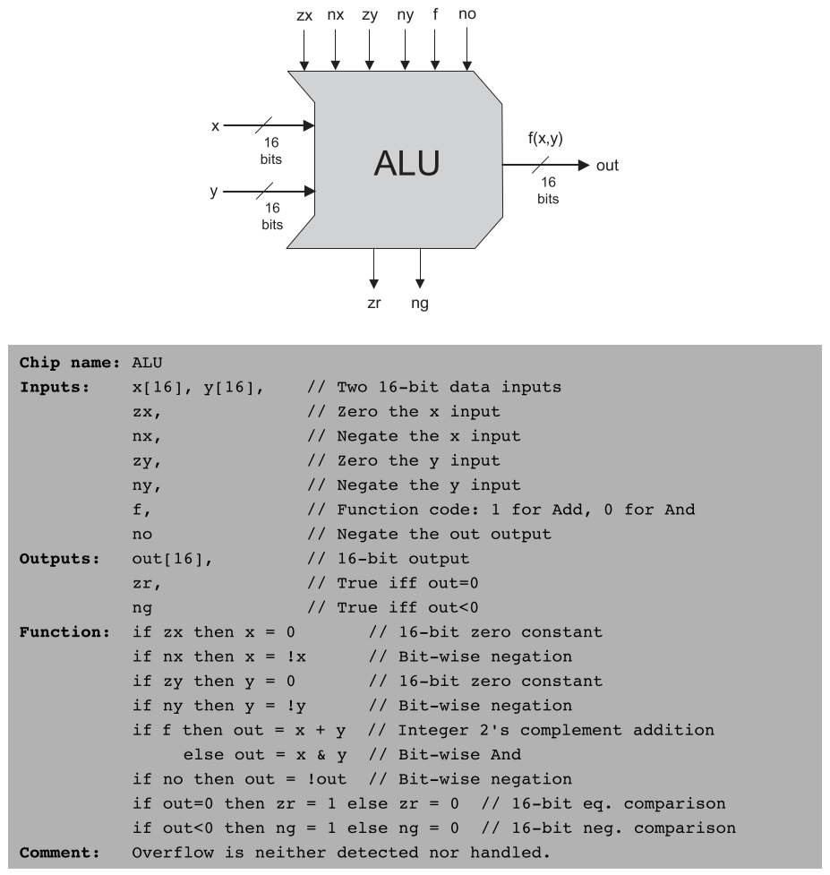
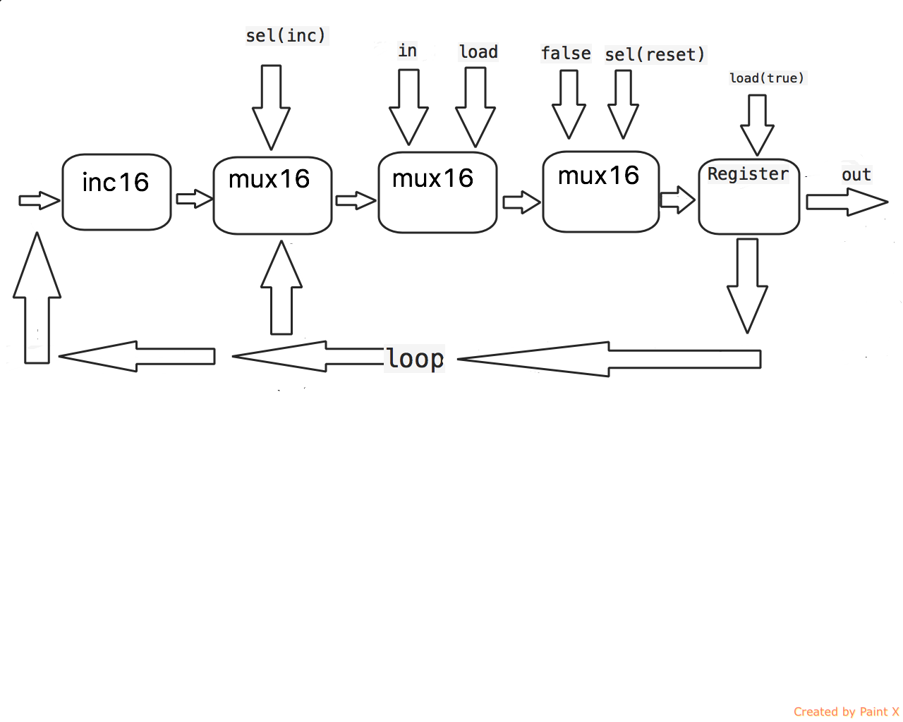

# Desarrollo (Práctica 2)

## HalfAdder
Siguiendo la tabla de verdad producida por esta compuerta, se evidencia que las salidas carry y sum corresponden a las compuertas And y Xor, respectivamente.

<p align='center'>

</p>

```
CHIP HalfAdder {
    IN a, b;    // 1-bit inputs
    OUT sum,    // Right bit of a + b 
        carry;  // Left bit of a + b

    PARTS:
    And(a=a, b=b, out=carry);
    Xor(a=a, b=b, out=sum);
}
```

## FullAdder
Igual al nombre, el chip FullAdder puede ser concretado uniendo dos veces el chip de half adder.

<p align='center'>

</p>

```
CHIP FullAdder {
    IN a, b, c;  // 1-bit inputs
    OUT sum,     // Right bit of a + b + c
        carry;   // Left bit of a + b + c

    PARTS:
    HalfAdder(a=a, b=b, sum=sumab, carry=carrya);
    HalfAdder(a=sumab, b=c, sum=sum, carry=carryb);
    Or(a=carrya, b=carryb, out=carry);
}
```

## Add16
Recurriendo a las compuertas recién creadas de adición, se puede hacer un llamado para cada uno de los valores de las cadenas de entrada.

<p align='center'>

</p>

```
CHIP Add16 {
    IN a[16], b[16];
    OUT out[16];

    PARTS:
    HalfAdder(a=a[0], b=b[0], sum=out[0], carry=carry0);
    FullAdder(a=a[1], b=b[1], c=carry0, sum=out[1], carry=carry1);
    FullAdder(a=a[2], b=b[2], c=carry1, sum=out[2], carry=carry2);
    FullAdder(a=a[3], b=b[3], c=carry2, sum=out[3], carry=carry3);
    FullAdder(a=a[4], b=b[4], c=carry3, sum=out[4], carry=carry4);
    FullAdder(a=a[5], b=b[5], c=carry4, sum=out[5], carry=carry5);
    FullAdder(a=a[6], b=b[6], c=carry5, sum=out[6], carry=carry6);
    FullAdder(a=a[7], b=b[7], c=carry6, sum=out[7], carry=carry7);
    FullAdder(a=a[8], b=b[8], c=carry7, sum=out[8], carry=carry8);
    FullAdder(a=a[9], b=b[9], c=carry8, sum=out[9], carry=carry9);
    FullAdder(a=a[10], b=b[10], c=carry9, sum=out[10], carry=carry10);
    FullAdder(a=a[11], b=b[11], c=carry10, sum=out[11], carry=carry11);
    FullAdder(a=a[12], b=b[12], c=carry11, sum=out[12], carry=carry12);
    FullAdder(a=a[13], b=b[13], c=carry12, sum=out[13], carry=carry13);
    FullAdder(a=a[14], b=b[14], c=carry13, sum=out[14], carry=carry14);
    FullAdder(a=a[15], b=b[15], c=carry14, sum=out[15], carry=carry15);
}
```

## Inc16

Para este chip se suma el número 1 a la entrada proporcionada, usando la compuerta de Add16.

```
CHIP Inc16 {
    IN in[16];
    OUT out[16];

    PARTS:
    Add16(a=in, b[0]=true, out=out);
}
```

## ALU

Principalmente, para hacer cero y negar las variables *x* y *y*, se usan compuertas Mux, cuya entrada *sel* corresponde a las entradas *zx*, *nx*, *zy* y *ny* que varían respectivamente el valor.

Nuevamente la compuerta Mux selecciona el tipo de operación que se realizara sobre *x* y *y*, siendo las entradas *a*, *b* y *sel*, las operaciones And, Add y la entrada *f*, respectivamente.

La salida final, se niega de ser necesario con la compuerta Mux y se muestra el resultado final. Consecuentemente, para conocer ng se toma el último elemento en la cadena del resultado de 16 bits, puesto que según la estructura del complemento a dos (two's complement) de ser 1 corresponde a un número negativo y 0 a un número positivo. Finalmente, se comprueba que cada elemento en la cadena final corresponda a cero con múltiples compuertas Or, si el resultado de esto es 0, se niega y *zr* valdría 1.

<p align='center'>

</p>

```
CHIP ALU {
    IN  
        x[16], y[16],  // 16-bit inputs        
        zx, // zero the x input?
        nx, // negate the x input?
        zy, // zero the y input?
        ny, // negate the y input?
        f,  // compute (out = x + y) or (out = x & y)?
        no; // negate the out output?
    OUT 
        out[16], // 16-bit output
        zr,      // if (out == 0) equals 1, else 0
        ng;      // if (out < 0)  equals 1, else 0

    PARTS:
    // zx
    Mux16(a=x, b=false, sel=zx, out=outZx);
    
    // nx
    Not16(in=outZx, out=notOutZx);
    Mux16(a=outZx, b=notOutZx, sel=nx, out=outNx);

    // zy
    Mux16(a=y, b=false, sel=zy, out=outZy);

    // ny
    Not16(in=outZy, out=notOutZy);
    Mux16(a=outZy, b=notOutZy, sel=ny, out=outNy);

    // f
    Add16(a=outNx, b=outNy, out=xAddy);
    And16(a=outNx, b=outNy, out=xAndy);
    Mux16(a=xAndy, b=xAddy, sel=f, out=outF);

    // no
    Not16(in=outF, out=notOutF);
    Mux16(a=outF, b=notOutF, sel=no, out=out, out[0..7]=firstZr, out[8..15]=secondZr, out[15]=ng);

    // zr
    Or8Way(in=firstZr, out=firstOut);
    Or8Way(in=secondZr, out=secondOut);
    Or(a=firstOut, b=secondOut, out=notZr);
    Not(in=notZr, out=zr);
}
```
## RAM512

La memoria RAM512 consta de ocho unidades RAM64, cada una compuesta por ocho bloques RAM8, y cada bloque RAM8 incorpora ocho registros de 16 bits. En total, hay 512 registros capaces de almacenar 1 KB de datos. Para la implementación se utiliza un demultiplexor 8-vías para dividir la señal de carga en ocho señales diferentes (a, b, ..., h) basadas en los tres bits de la dirección address[6..8]. Se instancian ocho bloques de memoria RAM64, cada uno operando en una parte diferente de la memoria total, y se conectan a las salidas del demultiplexor. Por último, Un multiplexor 8-vías elige el resultado correcto de los bloques RAM64 basándose en la dirección address[6..8].

```
CHIP RAM512 {
    IN in[16], load, address[9];
    OUT out[16];

    PARTS:
       DMux8Way(in=load,sel=address[6..8],a=a,b=b,c=c,d=d,e=e,f=f,g=g,h=h);

        RAM64(in=in,load=a,address=address[0..5],out=oa);
        RAM64(in=in,load=b,address=address[0..5],out=ob);
        RAM64(in=in,load=c,address=address[0..5],out=oc);
        RAM64(in=in,load=d,address=address[0..5],out=od);
        RAM64(in=in,load=e,address=address[0..5],out=oe);
        RAM64(in=in,load=f,address=address[0..5],out=of);
        RAM64(in=in,load=g,address=address[0..5],out=og);
        RAM64(in=in,load=h,address=address[0..5],out=oh);

	Mux8Way16(a=oa,b=ob,c=oc,d=od,e=oe,f=of,g=og,h=oh,sel=address[6..8],out=out);
}
```
## RAM4K

La RAM4K tiene la capacidad de almacenar 4 kilobytes (4096 bytes) de datos por lo que cada celda de memoria puede contener 16 bits de información. Podría constar de múltiples unidades de memoria más pequeñas, como RAM512 o RAM64, para alcanzar la capacidad total de 4 kilobytes.  Para la implementación se utiliza un demultiplexor 8-vías para seleccionar uno de los 8 bloques de RAM512 luego se instancian ocho bloques de RAM512, cada uno operando en una parte diferente de la memoria y por último un multiplexor 8-vías elige el resultado correcto de los bloques RAM512 basándose en la dirección. 

```
CHIP RAM4K {
    IN in[16], load, address[12];
    OUT out[16];

    PARTS:
    DMux8Way(in=load,sel=address[9..11],a=a,b=b,c=c,d=d,e=e,f=f,g=g,h=h);

    RAM512(in=in,load=a,address=address[0..8],out=oa);
    RAM512(in=in,load=b,address=address[0..8],out=ob);
    RAM512(in=in,load=c,address=address[0..8],out=oc);
    RAM512(in=in,load=d,address=address[0..8],out=od);
    RAM512(in=in,load=e,address=address[0..8],out=oe);
    RAM512(in=in,load=f,address=address[0..8],out=of);
    RAM512(in=in,load=g,address=address[0..8],out=og);
    RAM512(in=in,load=h,address=address[0..8],out=oh);

    Mux8Way16(a=oa,b=ob,c=oc,d=od,e=oe,f=of,g=og,h=oh,sel=address[9..11],out=out);
}
```
## RAM16K:

RAM16K está diseñado para gestionar una memoria RAM de 16 kilobytes, utilizando bloques de memoria RAM4K para dividir y direccionar eficientemente la capacidad total. Para su implementación se utiliza un demultiplexor 4-vías para dividir la señal de carga en cuatro señales diferentes (loada, loadb, loadc, loadd) basadas en los dos bits de la dirección address[12..13], se instancian cuatro bloques de memoria RAM4K, cada uno operando en una parte diferente de la memoria total, y se conectan a las salidas del demultiplexor. Por último, Un multiplexor 4-vías elige el resultado correcto de los bloques RAM4K basándose en la dirección address[12..13].

```
CHIP RAM16K {
    IN in[16], load, address[14];
    OUT out[16];

    PARTS:
        DMux4Way(in=load, sel=address[12..13], a=loada, b=loadb, c=loadc, d=loadd);
	RAM4K(in=in, load=loada, address=address[0..11], out=outa);
	RAM4K(in=in, load=loadb, address=address[0..11], out=outb);
	RAM4K(in=in, load=loadc, address=address[0..11], out=outc);
	RAM4K(in=in, load=loadd, address=address[0..11], out=outd);
	Mux4Way16(a=outa, b=outb, c=outc, d=outd, sel=address[12..13], out=out);	
}
```
## PC:
El PC se comporta como un contador que puede cargar, incrementar y resetear su valor. La salida representa la dirección de la próxima instrucción que el procesador debe ejecutar. Este diseño modular permite un control flexible del flujo de ejecución en un programa almacenado en memoria. Para su implementación, el componente Inc16 es un contador que se encarga de incrementar su entrada en 1, se utiliza un multiplexor (Mux16) para decidir entre la entrada incrementada (out1) y el valor actual del PC (loop). Otro multiplexor decide entre la entrada incrementada y la entrada in, basándose en la señal de carga (load). Un tercer multiplexor decide entre la entrada cargada y un valor falso (false) cuando se activa la señal de reset (reset). Por último, se utiliza un registro (Register) para almacenar el valor resultante después de todas las decisiones anteriores.

```
CHIP PC {
    IN in[16],inc, load, reset;
    OUT out[16];
    
    PARTS:
    Inc16(in=loop,out=out1);

    Mux16(a=loop,b=out1,sel=inc,out=incout);
    Mux16(a=incout,b=in,sel=load,out=loadout);
    Mux16(a=loadout,b=false,sel=reset,out=regout);

    Register(in=regout,load=true,out=loop,out=out);
}

```
<p align='center'>

</p>


## Preguntas adicionales

1. **¿Cuál es el objetivo de cada uno de estos proyectos con sus palabras y describa que debe hacer para desarrollarlo?**

    Una de las principales cosas que se pueden desarrollar con los proyectos realizados hasta el momento es una mejor lógica booleana, aritmética, secuencial y general, por lo que uno de los principales objetivos es aumentar la capacidad de resolución de problemas. Esto sumado a la intención de enseñar el funcionamiento y la estructura de un computador, para su posterior creación.

    Para llevar a cabo satisfactoriamente estos proyectos es necesario estudiar la representación de números binarios y sus operaciones, junto al conocimiento de lógica aritmética, booleana y secuencial.

2. **Explique las principales diferencias entre la lógica aritmética y la lógica secuencial.**
    
    La lógica aritmética se centra en realizar cálculos numéricos con operaciones matemáticas y aritméticas. Al pasar a la lógica secuencial se debe tener en cuenta el momento en el que se realizan eventos o acciones en un sistema digital, es decir, hay una memoria, contador o máquina de estado presente.

    **Bonus: ¿Qué tipo de unidades aritmético lógicas existen?**

    Algunas de las ALU's mas importantes que existen son:

    * **ALU** general: es la mas común y se usa para operaciones aritméticas y lógicas básicas.
    * **ALU FPU**: Se usa en operaciones con números de punto flotante (con parte decimal).
    * **ALU SIMD**: (Single Instruction, Multiple Data). Ejecuta la misma operación en múltiples datos a la vez.

## Bibliografía
[The elements of computing systems](https://www.nand2tetris.org/book)

[Apéndice 2: Guía HDL](https://drive.google.com/file/d/1dPj4XNby9iuAs-47U9k3xtYy9hJ-ET0T/view?usp=sharing)

[Lectura 2 (The elements of computing systems)](https://drive.google.com/file/d/1ie9s3GjM2TrvL7PrEZJ00gEwezgNLOBm/view)
